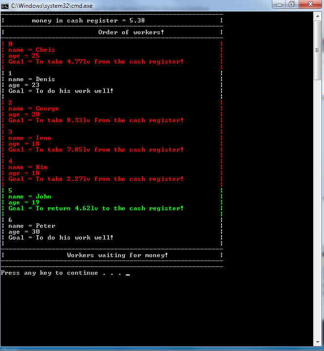

# CourseWork Descriptions
 Takes the file in which are data of the workers from the comand line. Checks if the file is text(.txt) then\
 puts the data in linked lis. At the beginning every worker decides what action to do(To  work properly,to\
 take money or to return money).\
 \
 Worker decides on random which of first two actions to do and the tird if he has already taken money(The amount\
 of money that worker returns is equal of that he has already taken). After that first worker does action, then goes back\
 at the end of the linked list and decides again his next action. If worker wants to take money, but in the cash\
 register aren't enought, he goes to another linked list and waits till in the cash register are enought money\
 (The amount of money that worker wants to take is genetated randomly).\
 \
 When in the cash register are enought money, first worker from waiting list goes at the beginning of the main\
 linked list and does action.(While first worker of the waiting list waits for money every other worker from main\
 list which wants money goes behind him in the waiting list).\
 \
 After every worker action the program pause.
 
 
 
# Images
  
